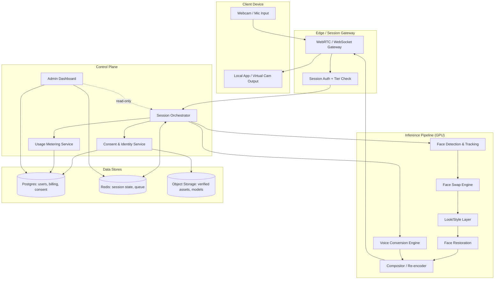
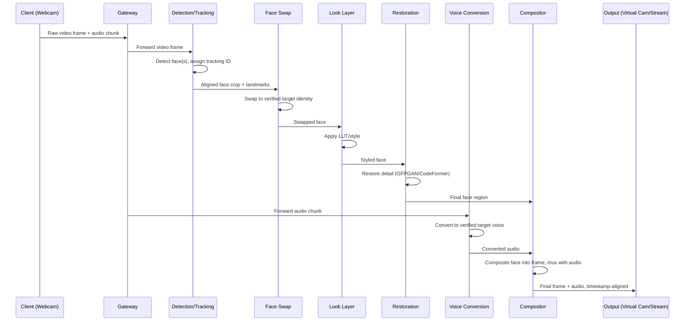
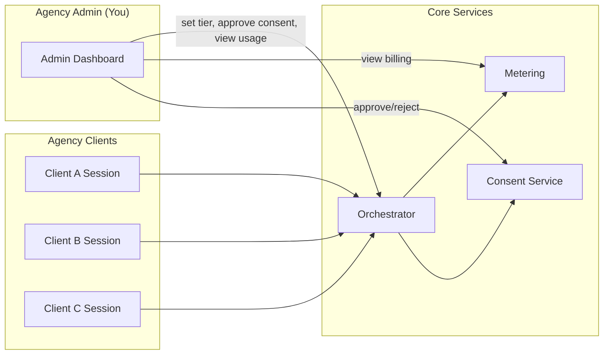
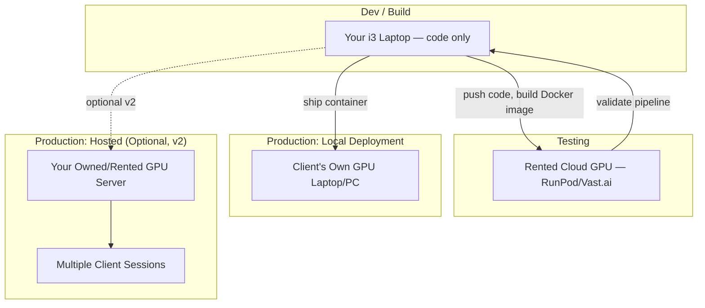

# System Architecture Document
## Real-Time AI Face, Look & Voice Transformation Platform

**Version:** 0.1 (Draft)

---

## 1. Architectural Principles

1. **Modular pipeline** — each transformation stage (detect, swap, style, restore, voice) is a separable component, so any stage can be upgraded, swapped, or quality-downgraded independently.
2. **Resource-budget-aware** — every stage declares its VRAM/CPU cost; the orchestrator enforces a hard per-session budget so one session can't starve another or crash the GPU.
3. **Consent-gated by construction** — the identity/voice selection step can only return verified, approved assets. There is no code path from "arbitrary uploaded image" to "swap target" without passing through verification.
4. **Local-first, cloud-optional** — the same container image runs on a client's local GPU machine or on a rented cloud GPU instance. No feature requires an internet connection except licensing/billing sync and consent-record sync.
5. **Admin plane is separate from the inference plane** — the admin dashboard never touches raw video/audio frames; it only reads metadata (usage, consent status, health metrics).

---

## 2. High-Level Component Diagram

---

## 3. Pipeline Detail (Per-Frame Flow)

---

## 4. Resource Budget Model (8GB VRAM target)

| Stage | Approx. VRAM | Notes |
|---|---|---|
| Face Detection/Tracking | 0.5–1GB | CPU-offloadable if GPU is tight |
| Face Swap (inswapper-class) | 2–3GB | Core cost |
| Face Restoration (GFPGAN) | 1–2GB | Can be skipped at lower quality tiers |
| Look/Style (LUT) | ~0GB | **v1 SKIP** — no built-in LUT in facefusion; revisit post-voice-conversion |
| Look/Style (GAN, premium) | 1–2GB | **v1 SKIP** — frame_colorizer/frame_enhancer carry real VRAM cost; out of Basic-tier budget alongside voice |
| Voice Conversion | 1–3GB | Runs concurrently, must be budgeted alongside video |
| **Total (Basic tier, single face, v1)** | **~3–4GB** | face_swapper + detection + NSFW gate; no style layer active |
| **Total (Basic tier, single face, full)** | **~5–7GB** | Fits comfortably on 8GB (future, post-voice proven) |
| **Total (Pro tier, GAN style + voice)** | **~7–9GB** | At or over 8GB — needs automatic downgrade path |

> **v1 scope decision (2026-10-01):** Style layer skipped for v1. No LUT
> equivalent exists in facefusion; ML-based alternatives (frame_colorizer,
> frame_enhancer) add 0.3–1 GB VRAM not reflected in the Basic-tier budget
> once voice conversion (~1–3 GB) runs concurrently. Revisit after the
> core swap+voice pipeline is proven on real GPU hardware.

The Session Orchestrator must check this budget **before** starting a session and downgrade quality tier automatically rather than let a stage OOM mid-session.

---

## 5. Multi-Tenancy & Admin Control

- Each client session is isolated: its own resource budget, its own consent-verified identity set, its own usage ledger.
- The admin dashboard is the **only** place quality tiers, feature flags, and consent approvals are changed — never per-session client-side.

---

## 6. Technology Choices (Suitable, Not Biased Toward One Vendor)

| Layer | Recommended Tech | Why |
|---|---|---|
| Media transport | WebRTC | Purpose-built for low-latency audio/video; beats raw WebSocket frame streaming |
| Face detection | RetinaFace or YOLO-face | Fast, well-supported, good multi-face accuracy |
| Face tracking (future multi-face) | ByteTrack / DeepSORT with ArcFace re-ID embeddings | Keeps identity stable across frames |
| Face swap | ONNX Runtime running an inswapper-class model | Hardware-portable (CUDA/TensorRT/CoreML execution providers) |
| Restoration | GFPGAN or CodeFormer | Both open-source, proven in real-time face-swap tools |
| Voice conversion | RVC or OpenVoice | Lightweight enough to run alongside video on shared VRAM |
| Orchestration | Python backend service (FastAPI) | Matches your existing Python/Go/Flutter stack; FastAPI is async-friendly for session handling |
| Queue/session state | Redis | Low-latency session state, pub/sub for orchestrator events |
| Persistent data | PostgreSQL | Users, billing ledger, consent records — relational integrity matters here |
| Object storage | S3-compatible (MinIO for local, S3 for cloud) | Verified identity assets, model weights |
| Containerization | Docker, with NVIDIA CUDA base image | Portable between your dev laptop, rented GPU, and client hardware |
| Admin dashboard | React/Next.js (matches your existing stack) | Fast to build, you already know it |
| Model serving (optional, at scale) | Triton Inference Server or a simple ONNX Runtime server | Only needed once you have multiple concurrent sessions pooling one GPU |

---

## 7. Deployment Topologies

- **v1 recommended path:** ship the Docker container to run **on the client's own GPU hardware** (local deployment). This avoids you bearing recurring production GPU cost per client and sidesteps the network-latency problem discussed earlier.
- **v2 option:** host it yourself for clients without suitable hardware — this reintroduces the per-minute cloud GPU cost into your pricing model, so only pursue once minute-pricing is validated against real $/hour figures.
