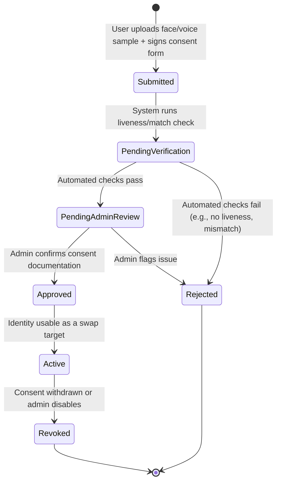

# Consent & Data Handling Policy
## Internal Engineering Specification (not a substitute for legal ToS)

**Version:** 0.1 (Draft)

---

## 1. Purpose

This document specifies the **technical, enforced** rules for how identities (faces, voices) enter and are used in the system. It is written as an engineering spec because the consent gate must be a hard code path, not a policy that relies on user honesty.

---

## 2. Core Rule

> **No face or voice may be selectable as a swap target unless it has passed the Verification & Consent workflow below and been approved in the Admin Dashboard.**

This applies even to the system owner's own test identities during development.

---

## 3. Identity Onboarding Workflow

### Required fields at submission
- Full legal name of the identity owner
- Signed consent document (explicit, written, time-stamped, naming the specific use: "real-time video/voice transformation by [agency/client]")
- Liveness-verified sample capture (not a static uploaded photo pulled from elsewhere — must be captured live, with timestamp, during onboarding)
- Relationship/authorization record if the identity owner is not the end user themselves (e.g., a licensed avatar character, a company-owned mascot persona)

### What the system must reject automatically
- Any face/voice sample that fails liveness detection
- Any sample matching a public figure/celebrity face database (if available) without a separate, elevated verification tier — public figures carry additional right-of-publicity risk
- Duplicate submissions without a matching consent record

---

## 4. Data Classification & Storage Rules

| Data type | Classification | Storage | Retention |
|---|---|---|---|
| Raw consent document (signed form) | Sensitive — legal record | Encrypted object storage, access-logged | Retained for the life of the account + legal minimum period after revocation |
| Verified face/voice sample | Sensitive — biometric | Encrypted object storage, never in plaintext logs | Deleted on revocation, within a defined SLA (e.g., 7 days) |
| Live session video/audio frames | Transient | **Not persisted** by default — processed in-memory, discarded after frame output | N/A (do not record unless the user explicitly opts in to session recording, logged separately) |
| Usage/billing metadata (minutes, tier, timestamp) | Operational | PostgreSQL | Standard business retention |
| Audit log (who swapped to which identity, when) | Compliance-critical | Append-only log store | Long retention — this is your accountability trail if misuse is ever alleged |

**Key design decision:** live frames are **not recorded by default**. This both protects user privacy and reduces your own liability surface — you can't be asked to produce footage you never kept, and it removes an entire category of data-breach risk.

---

## 5. Audit Logging Requirements

Every swap session must log, at minimum:
- Session ID, client account, timestamp (start/end)
- Which verified identity ID was used as the swap target (not the raw biometric data — just the reference ID)
- Quality tier used
- Whether voice conversion was active, and which verified voice ID

This log is what lets you answer "who used what, when" if a dispute or misuse report ever arises — treat it as evidence infrastructure, not just analytics.

---

## 6. Revocation Handling

- An identity owner can request revocation at any time (through the admin, not self-service in v1, since onboarding is agency-mediated)
- On revocation: identity immediately removed from the selectable list, in-flight sessions using it are terminated, stored biometric samples deleted per the SLA in §4
- Revocation does **not** delete the audit log — past usage records remain for accountability

---

## 7. Explicit Prohibitions (Hard-Coded, Not Just Policy)

The following must be **structurally impossible**, not merely discouraged:
- Uploading an arbitrary photo/voice found online and using it as a swap target without going through §3
- Using a verified identity for a purpose outside what the consent document named
- Any feature or configuration whose purpose is to defeat a third-party biometric authentication/liveness system. This is excluded from the product entirely — not a toggle, not a tier, not a client-requestable feature.

---

## 8. What This Document Does Not Cover

- Jurisdiction-specific legal requirements (consult a lawyer for Nigerian NDPR compliance and any jurisdiction your clients operate in — this document is an engineering spec, not legal advice)
- Payment processor / platform ToS compliance — verify separately per the Deployment Runbook
