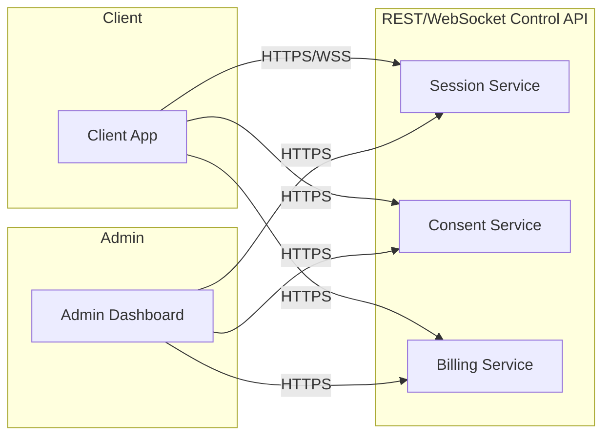

# API / Interface Contract
## Real-Time AI Face, Look & Voice Transformation Platform

**Version:** 0.1 (Draft)

---

## 1. Scope

Defines the interfaces between: Client App ↔ Gateway ↔ Session Orchestrator ↔ Admin Dashboard. Transport-level media (raw video/audio frames) flows over WebRTC and is **not** represented as REST payloads below — only control/session/metadata APIs are.

---

## 2. Service Boundaries



---

## 3. Session Service

### `POST /v1/sessions/start`
Starts a new transformation session for an authenticated client.

**Request**
```json
{
  "client_id": "string",
  "target_identity_id": "string (must be an Approved identity — see Consent Service)",
  "voice_target_id": "string | null",
  "quality_tier": "basic | pro | studio",
  "device_capability": {
    "gpu_vram_gb": 8,
    "platform": "local | hosted"
  }
}
```

**Response (200)**
```json
{
  "session_id": "uuid",
  "websocket_url": "wss://.../session/{session_id}",
  "granted_quality_tier": "basic",
  "reason_if_downgraded": "string | null",
  "resource_budget": {
    "vram_allocated_gb": 6.5
  }
}
```

**Error cases**
| Code | Meaning |
|---|---|
| 403 | `target_identity_id` not in Approved state (see Consent Service) |
| 409 | Client has no remaining minutes / tier not purchased |
| 422 | Declared `device_capability` insufficient for any tier |

### `POST /v1/sessions/{session_id}/end`
Ends a session, finalizes usage metering.

**Response**
```json
{
  "session_id": "uuid",
  "duration_seconds": 1800,
  "quality_tier_used": "basic",
  "minutes_billed": 30
}
```

### `GET /v1/sessions/{session_id}/status`
Health/diagnostic — frame rate, dropped frames, current VRAM usage. Used by the client app to show a live performance indicator, and by the admin dashboard for monitoring.

---

## 4. Consent Service

### `POST /v1/identities/submit`
Submits a new identity for verification (admin-mediated in v1 — called by agency staff, not end clients directly).

**Request**
```json
{
  "owner_legal_name": "string",
  "consent_document_ref": "string (object storage ref)",
  "live_sample_ref": "string (object storage ref, video capture, not static upload)",
  "sample_type": "face | voice | both",
  "authorized_use": "string (free text, must match consent document)"
}
```

**Response**
```json
{
  "identity_id": "uuid",
  "status": "pending_verification"
}
```

### `GET /v1/identities/{identity_id}`
Returns status only — never returns raw biometric data over this API.

```json
{
  "identity_id": "uuid",
  "status": "pending_verification | pending_admin_review | approved | rejected | revoked",
  "sample_type": "face | voice | both"
}
```

### `POST /v1/identities/{identity_id}/revoke`
Admin-only. Immediately removes identity from selectable pool, triggers deletion SLA per the Consent & Data Policy doc.

---

## 5. Billing Service

### `GET /v1/clients/{client_id}/usage`
```json
{
  "client_id": "string",
  "minutes_remaining": 120,
  "current_tier": "pro",
  "usage_this_period": [
    { "session_id": "uuid", "date": "2026-10-01", "minutes": 30, "tier": "basic" }
  ]
}
```

### `POST /v1/clients/{client_id}/purchase-minutes`
```json
{
  "minute_pack": "60 | 300 | 1000",
  "payment_reference": "string"
}
```

---

## 6. Admin Dashboard — Internal Read APIs

These are read/management endpoints only — the dashboard never issues inference commands directly.

| Endpoint | Purpose |
|---|---|
| `GET /v1/admin/clients` | List clients, tiers, usage summaries |
| `GET /v1/admin/identities?status=pending_admin_review` | Review queue for consent approvals |
| `POST /v1/admin/identities/{id}/approve` | Approve an identity after manual review |
| `GET /v1/admin/system/health` | GPU load, active session count, error rates |
| `GET /v1/admin/audit-log?session_id=` | Pull audit trail for a given session (see Consent Policy §5) |

---

## 7. WebSocket Media Channel (Reference, Not REST)

Once a session starts, the client connects to `wss://.../session/{session_id}` and streams WebRTC media. Control messages over the same channel (JSON, not raw media):

```json
{ "type": "tier_change_request", "new_tier": "pro" }
{ "type": "performance_warning", "fps_current": 14, "fps_target": 24 }
{ "type": "session_terminated", "reason": "minutes_exhausted | identity_revoked | error" }
```

---

## 8. Versioning Convention

All endpoints are prefixed `/v1/`. Breaking changes bump to `/v2/` — do not silently change response shapes on `/v1/` once a client app depends on it.
