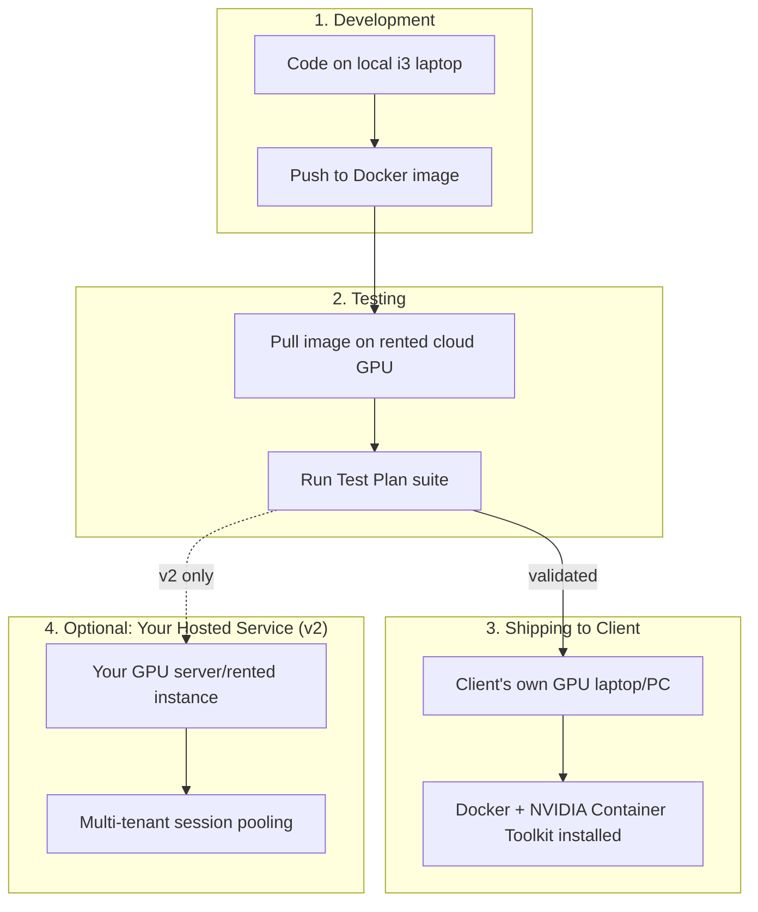

# Deployment Runbook
## Real-Time AI Face, Look & Voice Transformation Platform

**Version:** 0.1 (Draft)

---

## 1. Deployment Models Overview



---

## 2. Local Development Setup (Your i3 Laptop)

1. Install Docker Desktop (or Docker Engine on Linux)
2. Clone the project repository
3. Code against the service boundaries defined in the API Contract — no GPU needed for this stage
4. Use `docker-compose` to run non-GPU services locally (Postgres, Redis, API services) for integration testing of logic that doesn't need actual inference

```bash
docker compose up postgres redis api-gateway consent-service billing-service
```

---

## 3. Cloud GPU Testing Setup (RunPod / Vast.ai)

1. Provision an instance (RTX 3090/4090-class, CUDA 12.x base image)
2. Pull your project's Docker image onto the instance
3. Mount test video/audio samples
4. Run the inference services with GPU access:

```bash
docker run --gpus all \
  -v $(pwd)/models:/app/models \
  -v $(pwd)/test-samples:/app/test-samples \
  your-registry/inference-service:latest
```

5. Run the Test Plan suite (see `05-TEST-PLAN.md`), record benchmarks
6. **Shut down the instance when not actively testing** — this is the single biggest cost control lever (RunPod/Vast.ai bill per active hour)

### Cost tracking checklist
- [ ] Log every testing session's duration and instance type
- [ ] Reconcile against the $20–$250 development GPU budget range from project planning
- [ ] Flag immediately if cumulative spend exceeds budget by >20%

---

## 4. Shipping to a Client (Local Deployment Model)

### Pre-requisites on client machine
- NVIDIA GPU driver installed (version matching your CUDA base image requirement)
- NVIDIA Container Toolkit installed (enables `--gpus all` in Docker)
- Docker installed

### Handoff package contents
- Docker image (or Dockerfile + build instructions if you prefer them to build locally)
- `docker-compose.yml` wired to their local GPU
- `.env.example` with required configuration (API keys, admin endpoint URL if using centralized consent/billing)
- README with:
  - Exact GPU/driver requirements
  - How to start/stop the service
  - How to verify it's running correctly (point to a health-check endpoint)
  - Who to contact (you) for issues

### Verification steps on handoff
1. Run `nvidia-smi` on client machine — confirm driver + GPU visible
2. Run the container, confirm the health-check endpoint responds
3. Run a short (2–3 minute) live test with the client present, confirm acceptable FPS
4. Confirm billing/metering correctly reports back to your central billing service (if centralized) or logs locally (if fully offline)

---

## 5. Centralized vs. Fully Offline Billing — Decision Point

| Model | Pros | Cons |
|---|---|---|
| **Centralized** (client machine reports usage to your server) | Real-time billing accuracy, easier fraud prevention, central admin visibility | Requires internet connectivity on client machine, you must host the billing service |
| **Fully offline** (client machine logs usage locally, syncs periodically) | Works without constant connectivity | Harder to prevent usage-log tampering, delayed billing visibility |

**Recommendation:** centralized reporting with a local buffer/retry queue if connectivity drops — gives you real billing integrity without requiring 100% uptime connectivity.

---

## 6. Admin Dashboard Deployment

- Host separately from any single client's inference instance (it's a control plane, not part of the inference pipeline — see Architecture doc §1.5)
- Suggested: deploy on a small, cheap always-on instance (does not need GPU) — a $5-10/month VPS is sufficient since it's only serving metadata/dashboard traffic
- Secure with proper authentication (this holds consent records and billing data — treat it as the most sensitive part of the whole system)

---

## 7. Pricing Validation Checklist (Before Finalizing Client Pricing)

- [ ] Confirm actual $/hour for your chosen cloud GPU tier (if offering hosted option)
- [ ] Confirm actual client-hardware deployment has **zero recurring GPU cost to you** (local deployment model)
- [ ] Price per-minute rate above your real cost-per-minute floor, with margin
- [ ] Re-validate pricing if you move from local-deployment model to hosted model — the cost structure changes completely (see Architecture doc §7)

---

## 8. Rollback Plan

- Keep the previous Docker image tag available for at least one release cycle
- If a model update (new swap/voice model version) regresses performance or quality, roll back to the last tagged image while debugging — never leave a client on a known-broken version while you investigate
